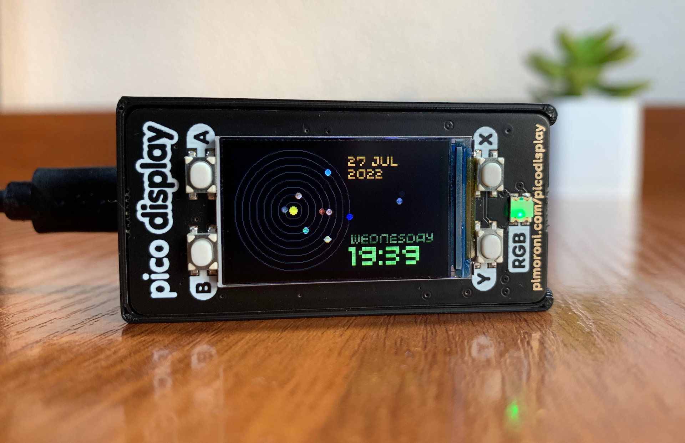

# Pico Solar System

A miniature device depicting the relative position of the planets in Solar System.



### Hardware
* Raspberry Pi Pico
* Precision RTC Module (DS3231)
* Pico Display Pack


### Software
#### MicroPython
The software is written in MicroPython 1.15 and uses a custom build from Pimorony which includes drivers for the display.
Download it from the official Pimorony repository [here](https://github.com/pimoroni/pimoroni-pico/releases/tag/v0.2.1).

1. Download the MicroPython UF2.
2. Push and hold the BOOTSEL button and plug your Pico into the USB port of your computer. Release the BOOTSEL button after your Pico is connected.
3. It will mount as a Mass Storage Device called RPI-RP2.
4. Drag and drop the MicroPython UF2 file onto the RPI-RP2 volume. 

#### rshell
To upload and configure your Pico Solar System you will need to install rshell. Make sure you have _pip_ installed.
```
pip3 install rshell
```

#### Installing Pico Solar System
1. Download Pico Solar System
```
git clone https://github.com/dr-mod/pico-solar-system.git
```
2. Open the directory with the source code
```
cd pico-solar-system
```
3. Copy required python files to your pico
```
rshell
cp *.py /pyboard/
```
4. Set time & configure the RTC module 
```
repl

import time
import ds3231
rtc = ds3231.ds3231()
rtc.set_time(time.time())
```
This may be in UTC time. If it is, and you want to offset your timezone in seconds, you can do that (example here is EDT)
```
rtc.set_time(time.time()-14400)
```

### Case 
A 3d printable case for this project can be found [here](https://www.thingiverse.com/thing:4916482).

### Support the project
If you would like to support what I do and keep me caffeinated, you can do it here:

[](https://www.buymeacoffee.com/drmod)
